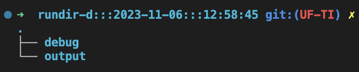
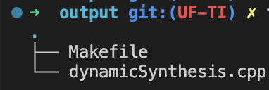
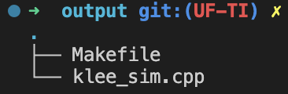

# SPARC : Specification and Analysis of Hardware-Software Interactions
#### Version: 0.1
#### Release Date: August 09, 2023

### A Brief Description:
In SPARC, we used a set of existing constructs from C++ and loops, functions, structures, and data types are used to define the constructs. We augmented SPARC with new data types to account for the binary and hexadecimal nature of the data transferred during on-chip transactions. Since SPARC is designed to provide abstraction of system-level communication, the technical details of various bus protocol implementations
are encapsulated into APIs “baked” into the language abstraction. All inter-IP interactions are oblivious to existing bus implementations to enable reusability of SPARC specifications across platforms and interconnect protocols.
<br>


Each agent/entity can be derived from the **slave class [slaveconfig.cpp]**. This will be revised in the future to support more base class agent types.

### Requirements
1. This version of SPARC requires C++17 or above to build.
2. KLEE is required for formal analysis of specifications generated using SPARC. It can be downloaded by clicking [here](https://klee.github.io/).

### SPARC Setup Guide
Once the KLEE setup has been completed, the following sequence of steps need to be followed: <br>
1. Attach your shell to the KLEE Docker container. 
2. cd into the following path:
```C++
cd /home/klee/klee_src/examples
``` 
3. Clone the SPARC repository at this location.
4. Create a new directory in the path /SPARC/examples/ and copy all the specification files and headers in this directory.
5. Create a configuration file in the same directory called 'config.json'. More details on this configuration file is provided in the upcoming section.

### SPARC Configuration File
SPARC uses a configuration file for running synthesis and validation under various modes. As of November 11, 2023, SPARC supports the following configuration options:
 - org_specification_file : name of the .cpp specification code
 - dynamicValidation : boolean (true/false, runs specification validation in dynamic mode if true) 
 - formalValidation : boolean (true/false, runs specification validation in formal mode if true) 
 - queueSize : size of queue for formal validation mode (discarded if dynamicValidation = true)
 - z3Solver :  boolean (true/false, uses z3 SMT solver for formal validation if true)

An example of a configuration file (spec4agent.cpp) running in both dynamic and formal validation mode with a queue size of 8 using z3 SMT solver is provided below:
```JSON
{
    "org_specification_file" : "spec4agent.cpp",
    "dynamicValidation" : true,
    "formalValidation" : true,
    "queueSize": 8,
    "z3Solver" : true
}
``` 

### SPARC Synthesis Guide
SPARC supports two modes of specification synthesis: (1) Dynamic synthesis, (2) Formal synthesis.
#### Dynamic synthesis
Once the system specification is complete, follow the below steps:
1. Modify the configuration file as highlighted above.
2. Run the following command to generate the test harness for SPARC:
    ```Python
    python3 ../../scripts/sparcWrapper.py
    ```
3. This will generate a new directory with intermediate logs and a final output with a makefile. The newly created directory structure is as follows: <br>

    
4. The output directory has the synthesized specification and a Makefile to run the specification. The structure of the output directory is as follows: <br>
        

5. To run the synthesized specification, cd into the output directory and run:
    ```C++
    make dynamicvalidation
    ``` 

#### Formal synthesis
SPARC uses a concurrent-to-non-concurrent program transformation to generate the test harness for formal analysis. The flow is shown in the figure below. <br>


Once the system specification is complete, follow the below steps:
1. Follow steps 1 and 2 from the Dynamic synthesis section above. The output directory has the synthesized specification and a Makefile to run the specification. The structure of the output directory is as follows: <br>


2. To synthesize the generated test harness, cd into the output directory and run::
```C++
make formalvalidation
``` 
### Agent Specification Template
Agents in SPARC can be specified in isolation using the following template:

1. Extend the agent class from the slaveIP class. The template for agent definition is as follows:

```C++
class AGENT_NAME : public slaveIP{
    // First, declare all interface registers for this agent
    public:
        interfaceRegisters name_of_reg = {"name_of_reg","direction of interface register (INPUT/OUTPUT)"};
        interfaceRegisters reg2 = {"reg1","OUTPUT"};
   
    // Second, specify all functionalities of the agent inside individual functions. Note that the return type of these functions should be void.  
    public:
        void function1();
        void function2();
        void function3();
    
    // Third, any local/private variables or functions for the agent should be declared private and end with an _. 
    private:
        bool variable1_ = false;
        bool variable2_ = false;
};

// Here, all the function body can be specified. This can also be done in the function declaration above.
``` 
More documentation on each of the SPARC constructs and features can be found [here](/Documentation/). For a video walkthough, please click [here](https://drive.google.com/file/d/1FouqvEBRwxMwFEAk99wn_y9iO8KQwEN0/view?usp=sharing).

For further information or any issues related to this repository, please send an email to Kshitij Raj at kshitijraj@ufl.edu


